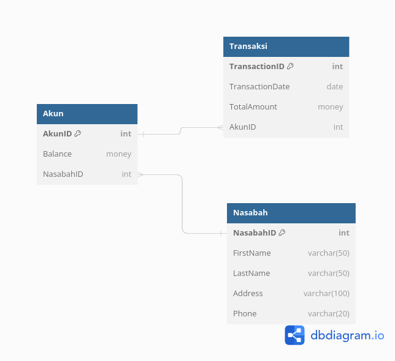

# Challenge Chapter 2

## Basic-Banking-System

Backend JavaScript Binar Academy

### Skill Metrics

- Programming Algorithm
- Melakukan error handling
- Menerapkan Asynchronous process
- Menerapkan OOP
- Menggunakan Git

### Criteria

- Menggunakan modular class OOP (40 points)
- Mengurai proses berpikir dengan menggunakan flowchart (30 points)
- Menggunakan GitHub untuk mengelola repository (30 points)

### pseudocode
"Program Bank System"

class BankAccount
    constructor(saldo, accountNumber)
        saldo = saldo
        accountNumber = accountNumber
    end constructor

    deposit(amount)
        amount = propmt
        If amount is not a number and is less than equal to 0 Then
            Show invalid input alert
        Else the number is equal to the number and more than 0
            saldo += amount
            Show latest balance
        End If
    End deposit

    withDraw(amount)
        If Your balance is less than equal to 0 Then 
            Your balance cannot be withdrawn yet
        Else 
            amount = Enter the balance you want to withdraw at the prompt
            If amount is not a number and is less than equal to 0 Then
                Show invalid input alert
            Else If If the amount is more than the balance Then
                Your balance cannot be withdrawn
            Else
                saldo -= amount
                 Show latest balance
            End If
        End If
    End withDraw

    displaySaldo()
        view-saldo = saldo
        Displays the balance in the browser
    End displaySaldo

    <!-- Private -->
    displayNumber()
        Displays account number
    End displayNumber

    talk()
        Returns displayNumber
    end talk
End BankAccount

class AccountUser inherits BankAccount
    constructor(saldo, accountNumber)
        super(saldo, accountNumber)
    end constructor

    deposit(amount)
        super.deposit(amount)
    End deposit

    withDraw(amount) 
        super.withDraw(amount)
    End withDraw
End class AccountUser

money = create an object from the AccountUser class
depositBank = Create a function to be displayed in the browser
witthDrawBank = Create a function to be displayed in the browser

# Challenge Chapter 3

## create_and_insert
Backend JavaScript Binar Academy

### Skill Metrics
- Database
- DBMS (Database Management System)
- Query Language
- Database Indexing and Query Optimazation
- RDBMS

### Delivery
- Analisa struktur data pada challenge 2
- Rancang Entity Relationship Diagram (ERD) sederhana yang mencakup tabel-tabel yang diperlukan
- Buat file SQL dengan nama create_and_insert.sql
- Tulis perintah SQL untuk membuat tabel-tabel sesuai dengan ERD yang Anda rancang
- Isi file SQL dengan perintah SQL untuk mengisi beberapa data awal ke dalam tabel-tabel

### Criteria
- Mampu merancang dan membuat ERD (40 points)
- Membuat Database & tabel menggunakan DDL (30 points)
- Melakukan operasi CRUD dengan DML (30 points)

### Studi Kasus
- Sebuah bank ingin membuat sistem untuk melacak informasi nasabah, akun, dan transaksi mereka. 
- Mereka ingin kamu merancang database yang sesuai dengan kebutuhan mereka.

### Merancang ERD

#### Tahap 1 - Menentukan entintas yang bakal terlibat
- Pada studi kasus ini terdapat entitas:
    - Nasabah
    - Akun
    - Transaksi

#### Tahap 2 - Menentukan atribut dari masing-masing entitas
- Dari ketiga entintas tersebut, maka tentukan atributnya:
    - Nasabah: id_nasabah, nama_nasabah, alamat_nasabah
    - Akun: id_akun, saldo
    - Transaksi: no_transaksi, tanggal, jumlah

#### Tahap 3 - Menentukan hubungan (relasi) antar entitas
- Setelah menentukan atribut diatas, maka langkah selanjutnya adalah menentukan relasi atau hubungan yang bakal terjadi antar entitas:
    - Satu Nasabah dapat memiliki beberapa Akun, tetapi setiap Akun hanya dimiliki oleh satu Nasabah. (One to Many)
    - Satu Akun dapat memiliki banyak Transaksi, tetapi setiap Transaksi hanya terkait dengan satu Akun. (One to Many) 

#### Tahap 4 - Membuat Model ERD
- Setelah kita sudah menentukan relasi dari tiap entitas maka kita bisa merancang ERDnya
- Dalam tahap ini, kita tinggal menggabungkan seluruh himpunan dan relasi dari tahap ketiga tadi dan membuat ilustrasinya.
- Dalam pembuatan ERD saya menggunakan dbdiagram.io

### Membuat SQL untuk mendefinisikan table 

#### Tahap 1 => Membuat Table Nasabah
- Kita buat table dengan perintah 'CREATE TABLE Nasabah'
- Lalu kita isi column pertama dengan 'NasabahID' yang merupakan ID dan diberikan Primary Key agar tiap baris dalam table ini bersifat unik, diberikan tipe data integer yang berupa angka
- Lalu kita isi column kedua dengan 'FirstName' yang merupakan nama depan nasabah dengan tipe data varchar yang berupa huruf dan angka.
- Lalu kita isi column ketiga dengan 'LastName' yang merupakan nama belakang nasabah dengan tipe data varchar yang berupa huruf dan angka.
- Lalu kita isi column keempat dengan 'Address' yang merupakan alaamt nasabah dengan tipe data varchar yang berupa huruf dan angka.
- Lalu kita isi column Kelima dengan 'Phone' yang merupakan nomor telephone nasabah dengan tipe data varchar yang berupa huruf dan angka.

#### Tahap 2 => Membuat Table Akun
- Kita buat table dengan perintah 'CREATE TABLE Akun'
- Lalu kita isi column pertama dengan 'AkunID' yang merupakan ID dan diberikan Primary Key agar tiap baris dalam table ini bersifat unik, diberikan tipe data integer yang berupa angka
- Lalu kita isi column kedua dengan 'Balance' yang merupakan jumlah uang dengan tipe data money.
- Lalu kita isi column ketiga dengan 'NasabahID' yang merupakan NasabahID dari table Nasabah pada table Nasabah dan Akun ini terdapat relasi One to Many jadi Satu Nasabah dapat memiliki beberapa Akun, tetapi setiap Akun hanya dimiliki oleh satu Nasabah. Pada column ini bertipe data integer.

#### Tahap 3 => Membuat Table Transaksi
- Kita buat table dengan perintah 'CREATE TABLE Transaksi'
- Lalu kita isi column pertama dengan 'TransactionID' yang merupakan ID dan diberikan Primary Key agar tiap baris dalam table ini bersifat unik, diberikan tipe data integer yang berupa angka
- Lalu kita isi column kedua dengan 'TransactionDate' yang merupakan tanggal saat kita melakukan transaksi dan diberikan tipe data date.
- Lalu kita isi colum ketiga dengan 'TotalAmount' yang merupakan total biaya saat transaksi dan diberikan tipe data money.
- Lalu kita isi column keempat dengan 'AkunID' yang merupakan AkunID dari table Akun pada table Nasabah dan Akun ini terdapat relasi One to Many jadi Satu Akun dapat memiliki banyak Transaksi, tetapi setiap Transaksi hanya terkait dengan satu Akun.
